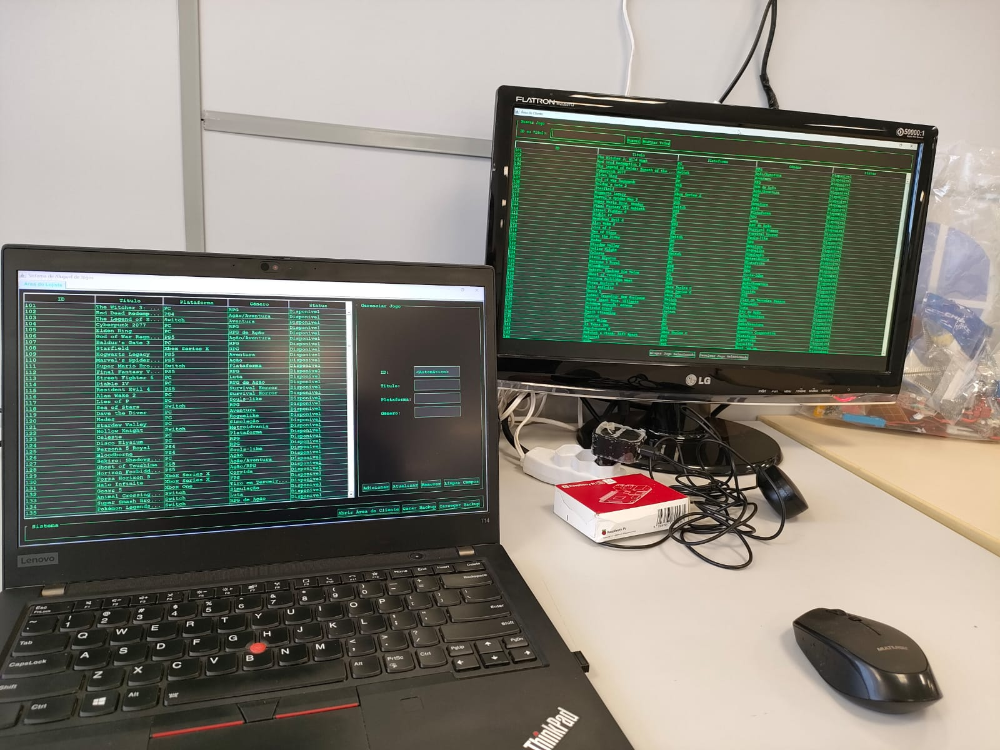
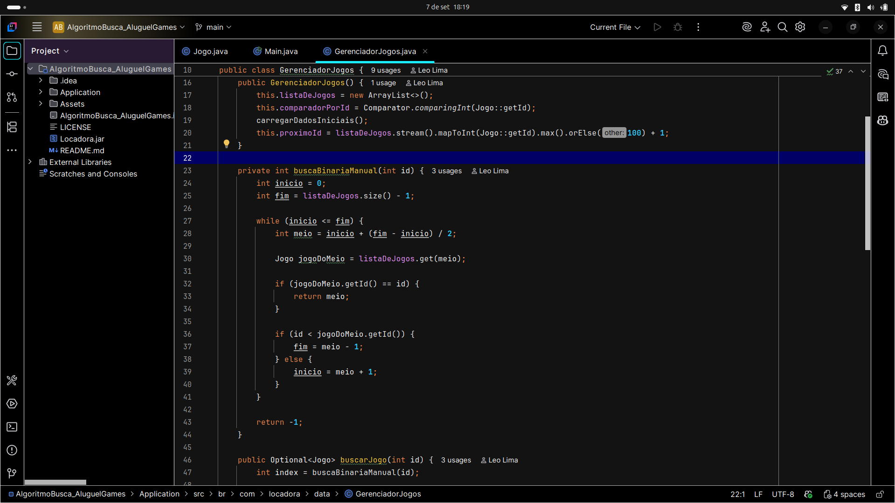
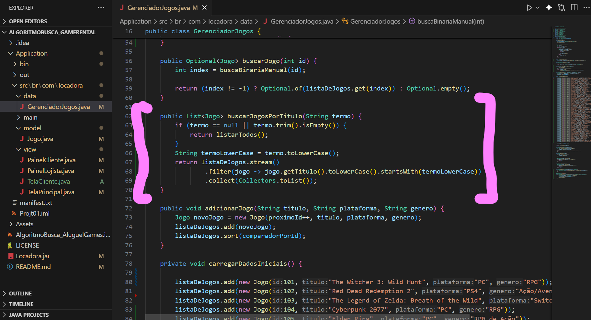

# Sistema de Aluguel de Jogos

**Conteúdo da Disciplina**: Métodos de Busca

-----

## Sobre o Projeto

Este projeto é uma aplicação de desktop para gerenciamento de aluguel de jogos, desenvolvido em Java com uma interface gráfica construída usando a biblioteca Swing. O sistema é projetado com duas visões principais:

  - **Visão do Lojista**: Acesso administrativo com controle total sobre o catálogo.
  - **Visão do Cliente**: Acesso simplificado para visualizar, alugar e devolver jogos.

O núcleo do sistema utiliza um `ArrayList` mantido sempre ordenado, com todas as operações de busca sendo realizadas por uma implementação manual e eficiente do algoritmo de **Busca Binária**.

-----

## Contribuidores

<center>

</head>
<body>

<table>
    <thead>
        <tr>
            <th>Matrícula</th>
            <th>Nome</th>
            <th>GitHub</th>
        </tr>
    </thead>
    <tbody>
        <tr>
            <td>202046102</td>
            <td>Felipe das Neves Freire</td>
            <td><a href="https://github.com/FelipeFreire-gf" target="_blank">Felipe</a></td>
        </tr>
        <tr>
            <td>222037700</td>
            <td>Leonardo de Melo Lima</td>
            <td><a href="https://github.com/leozinlima" target="_blank">Leonardo</a></td>
        </tr>
    </tbody>
</table>

</body>
</html>

</center>

-----

## Funcionalidades

  - **Painel do Lojista (Administrativo)**

      - Adicionar novos jogos com geração de ID incremental e automática.
      - Visualizar o catálogo completo com status (`Disponível`/`Alugado`).
      - Atualizar informações de jogos existentes.
      - Remover jogos do sistema permanentemente.
      - **Gerar Backup**: Salva todo o catálogo de jogos em um arquivo.
      - **Carregar Backup**: Restaura o catálogo de jogos a partir de um arquivo de backup.

  - **Painel do Cliente (Usuário)**

      - Visualizar o catálogo completo de jogos e seus status.
      - Alugar jogos marcados como "Disponível".
      - Devolver jogos previamente alugados.

-----

## Tecnologias Utilizadas

  - **Linguagem**: Java
  - **Interface Gráfica**: Java Swing

-----

## Screenshots

<div align="center">
  <font size="4"><p style="text-align: center; margin-bottom: 50px;"><b>Figura 1: Nosso Projeto Rodando</b></p></font>
</div>

<div align="center">

</div>

<div align="center">
  <font size="4"><p style="text-align: center; margin-bottom: 50px;"><b>Figura 2: Código da Busca Binária</b></p></font>
</div>

<div align="center">

</div>

<div align="center">
  <font size="4"><p style="text-align: center; margin-bottom: 50px;"><b>Figura 3: Código da Busca Linear</b></p></font>
</div>

<div align="center">

</div>

-----

## Como Usar (Para Usuários Finais)

Esta seção é para quem deseja apenas executar a aplicação.

1.  **Baixe o Programa**

      - Faça o download do arquivo `Locadora.jar`.

2.  **Pré-requisito**

      - Garanta que você tenha o **Java** (versão 11 ou superior, não-headless) instalado em seu computador.

3.  **Execute a Aplicação**

      - **Método 1 (Duplo-Clique)**: Na maioria dos sistemas operacionais, basta dar um duplo-clique no arquivo `Locadora.jar`.
      - **Método 2 (Via Terminal)**: Abra um terminal na pasta onde o arquivo foi salvo e execute o comando:
        ```bash
        java -jar Locadora.jar
        ```

-----

## Como Compilar (Para Desenvolvedores)

Esta seção é para desenvolvedores que desejam construir o programa a partir do código-fonte.

#### Pré-requisitos

  - **Java Development Kit (JDK)**, versão 11 ou superior (não-headless).

#### Estrutura de Pastas

Garanta que seu projeto tenha a seguinte estrutura de pastas:

```
SistemaDeJogos/
└── src/
    └── br/
        └── com/
            └── locadora/
                ├── data/
                ├── main/
                ├── model/
                └── view/
```

#### Passo a Passo para Construir

1.  **Compilar o Código-Fonte**

      - Abra um terminal na pasta raiz do projeto (`SistemaDeJogos/`) e execute o comando abaixo para compilar todos os arquivos `.java` para uma pasta `bin`.
        ```bash
        javac -d bin $(find src -name "*.java")
        ```

2.  **Criar o Arquivo de Manifesto**

      - O manifesto aponta para a classe principal. Crie um arquivo `manifest.txt` na raiz do projeto com o seguinte conteúdo (lembre-se de deixar uma linha em branco no final):
        ```text
        Main-Class: br.com.locadora.main.Main

        ```

3.  **Empacotar o JAR Executável**

      - Use a ferramenta `jar` do JDK para criar o arquivo final.
        ```bash
        jar cfm Locadora.jar manifest.txt -C bin .
        ```
      - O arquivo `Locadora.jar` será criado na pasta raiz do projeto.

-----

## Vídeo

<a href="https://youtu.be/TFeyVYnvyy4" target="_blank">
    <p align="center"><strong>Vídeo do Projeto</strong></p>
</a>
<p align="center">
  <a href="https://youtu.be/TFeyVYnvyy4" target="_blank">
    
  </a>
</p>
